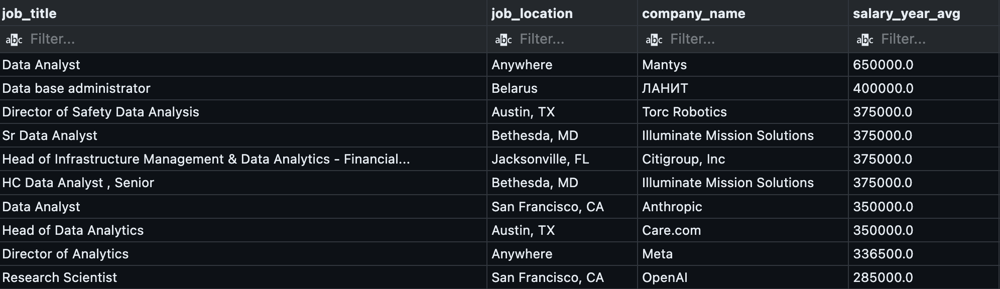
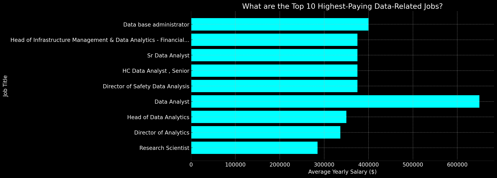
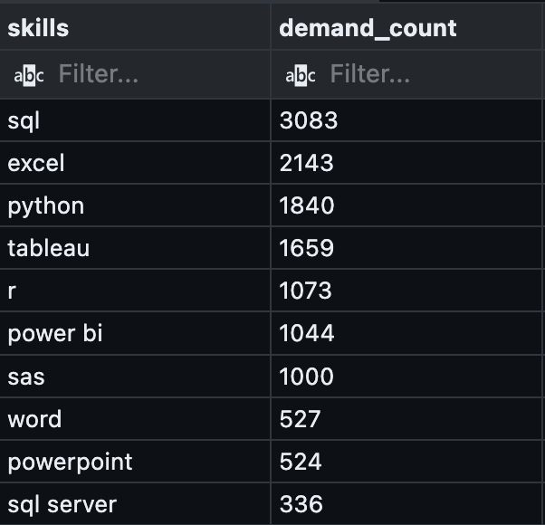
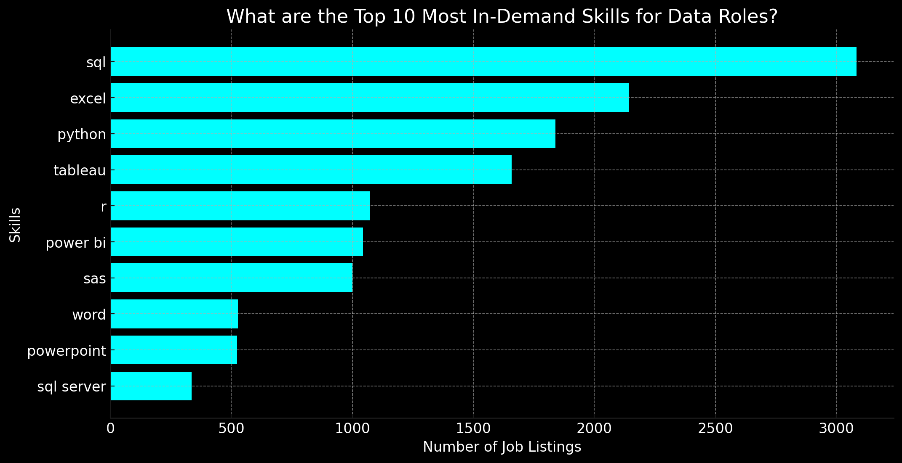
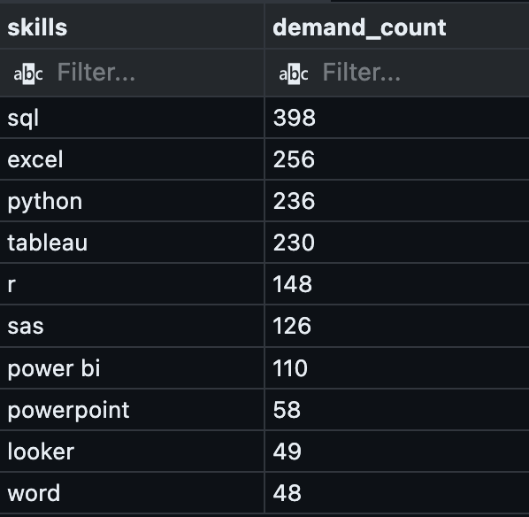
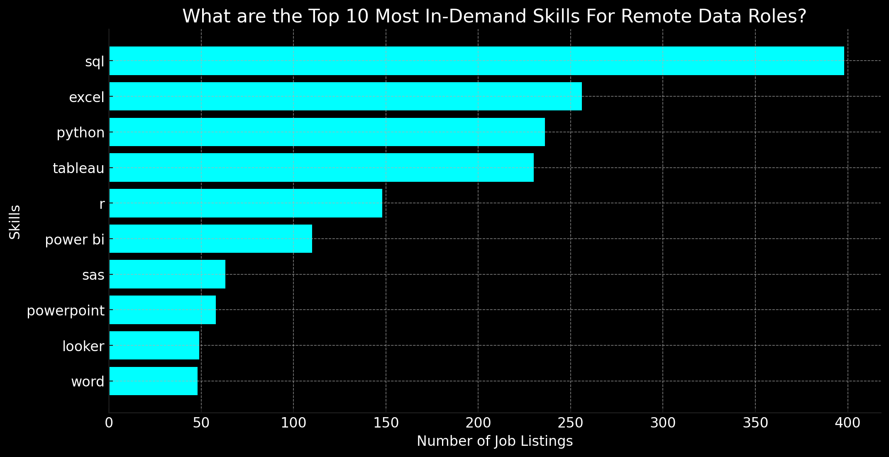
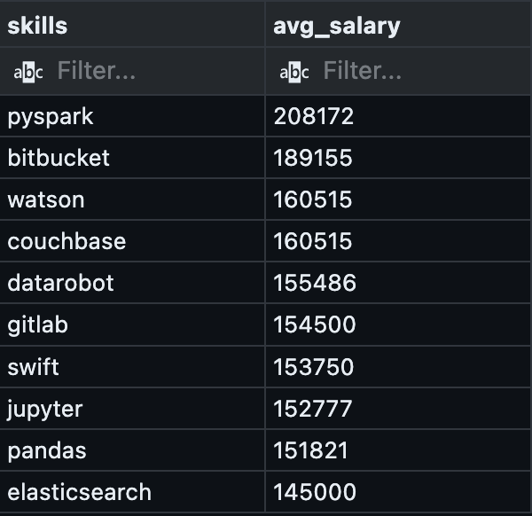
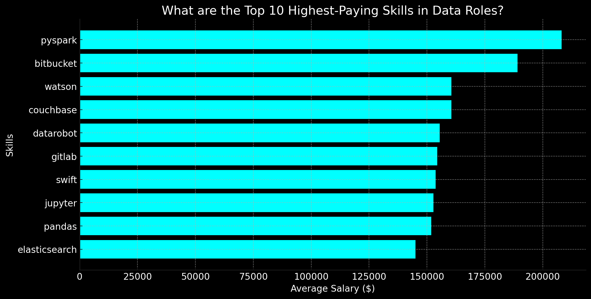
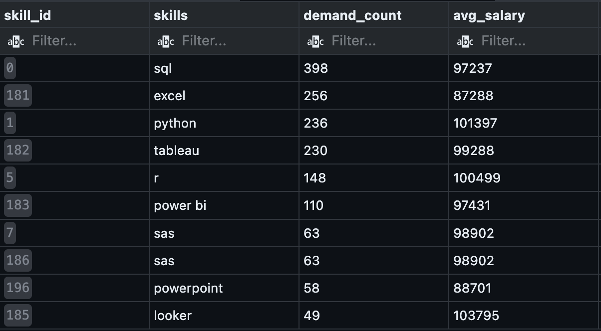
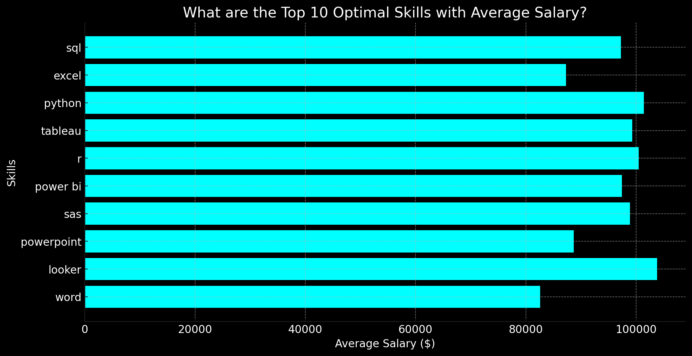

# sql_data_job_analysis
Using SQL in order to produce insights about data jobs, what skills to to keep in mind, and what salaries look like for Data Analysts roles.  

# Introduction
Dive into the data job market! I am focusing on Data analyst roles. This project explores top-paying jobs, in-demand skills, and where high demand meets high salary in data analytics. By producing meaningful insights from the data, I can also strategize on what skills I should focus on in order to get an entry-level Data Analyst role.

SQL queries? Check them out SQL queries here: [SQL Data Job Analysis Project](/)

# Background
My goal is to break into the Data Industry as a Data Analyst. I love working with data. Data is everywhere. It can provide us insights about the world around us. In this project I focus on what insights the data from 4 tables, *company_dim*, *job_postings_fact*, *skills_dim*, and *skills_job_dim*, can provide me. I also want to give a special mention to Luke Barousse for helping me out with this project. Thanks Luke

Throughout the investigation, I wanted to answer these questions through my SQL queries:
1. What are the top 10 paying Data Analyst jobs?
2. What are the most sought-after skills a Data Analyst should have?
3. What are the most in-demand skills for remote Data Analyst jobs?
4. What are the skills based on the average salary?
5. What are the most optimal skills to learn that are both in-demand and high-paying?

# Tools I Used
For my deep dive into the data analyst job market, I harnessed the power of several key tools:
- **SQL**: The backbone of my analysis allowing me to query the database and unearth critical insights.
- **PostgreSQL**: The chosen database management system, ideal for handling the job posting data.
- **Visual Studio Code**: My go-to for database management and executing SQL queries.
- **Git & GitHub**: Essential for version control and sharing my SQL scripts and analysis, ensuring collaboration and project tracking.
- **ChatGPT**: Helped a lot with the bar charts and giving me some insights about the results from my SQL queries.

# The Analysis
### 1. What are the top 10 paying Data Analyst jobs?
To identify the top 10 highest-paying roles, I filtered Data Analyst positions by average yearly salary. This query highlights the top 5 high-paying opportunities in the field.

```sql
SELECT
    job_title,
    job_location,
    company_dim.name AS company_name,
    salary_year_avg
FROM
    job_postings_fact
LEFT JOIN
    company_dim ON job_postings_fact.company_id = company_dim.company_id
WHERE
    job_title_short = 'Data Analyst'
    AND salary_year_avg IS NOT NULL
ORDER BY salary_year_avg DESC
LIMIT 10;
```




*The graph highlights the top 10 highest-paying data-related jobs, with Data Analyst ($650K) leading, followed by leadership and specialized roles, showing a strong correlation between expertise, management responsibilities, and salary growth; ChatGPT generated this graph from my SQL query result.*

#### INSIGHTS 💡 :
- **Top-Paid Role**: Data Analyst ($650K) leads the salary chart.

- **High Earners**: Leadership roles (Directors, Heads) dominate top salaries.

- **Research Pays Well**: Research Scientist ($285K) ranks high.

- **Broad Salary Range**: From $175K to $650K, showing strong variation by role and expertise.

---

### 2. What are the most sought-after skills a Data Analyst should have?
To be able to get a look at what are the skills Data Analyst job seekers should develop, I had to group the data by skill and count their occurrences within the data. I also had to join tables in order to get the desired data. Regardless of location, the query yields the top 10 sought-after skills Data Analysts should have.

```sql
WITH top_paying_jobs AS (
    SELECT
        job_id,
        job_title,
        job_title_short,
        job_location,
        company_dim.name AS company_name,
        salary_year_avg,
        job_schedule_type,
        job_posted_date
    FROM job_postings_fact
    LEFT JOIN company_dim ON job_postings_fact.company_id = company_dim.company_id
    WHERE
        job_title_short = 'Data Analyst'
        AND salary_year_avg IS NOT NULL
    ORDER BY salary_year_avg DESC
)

SELECT 
    skills_dim.skills,
    COUNT(*) AS demand_count
FROM top_paying_jobs
INNER JOIN skills_job_dim ON top_paying_jobs.job_id = skills_job_dim.job_id
INNER JOIN skills_dim ON skills_job_dim.skill_id = skills_dim.skill_id
GROUP BY skills
ORDER BY demand_count DESC
LIMIT 10;
```




*The bar chart highlights SQL as the most in-demand skill in data roles, followed by Excel, Python, and Tableau, emphasizing the importance of data querying, analysis, and visualization in the industry; ChatGPT generated this graph from my SQL query result.*

#### INSIGHTS 💡 :
- **Most In-Demand Skill**: SQL (3,083 listings) is the most sought-after skill in data roles.

- **Essential Tools**: Excel (2,143), Python (1,840), and Tableau (1,659) are highly valued.

- **BI & Data Visualization**: Power BI (1,044) and SAS (1,000) show strong demand for business intelligence skills.

- **Programming & Stats**: R (1,073) remains relevant for statistical analysis.

---

### 3. What are the most in-demand skills for remote Data Analyst jobs?
To gather what skills are needed for remote Data Analyst jobs. The question is pretty similar to the previous question, only that we now filter the location to only be remote. The query yields the top 5 skills desired for remote Data Analyst roles.

```sql
SELECT 
    skills_dim.skills,
    count(*) AS demand_count
FROM job_postings_fact
INNER JOIN skills_job_dim ON job_postings_fact.job_id = skills_job_dim.job_id
INNER JOIN skills_dim ON skills_job_dim.skill_id = skills_dim.skill_id
WHERE job_title_short = 'Data Analyst'
    AND job_work_from_home = TRUE 
    AND salary_year_avg is NOT NULL
GROUP BY skills
ORDER BY demand_count DESC
LIMIT 10;
```




*The chart highlights SQL as the most in-demand skill for data roles, followed by Excel, Python, and Tableau, emphasizing the importance of data management, analysis, and visualization in the industry. It is useful to note that the skill count in this chart, regardless of location, maintains its proportion with the previous graph; ChatGPT generated this graph from my SQL query result.*

#### INSIGHTS 💡 :
- **SQL Dominates**: Regardless of location, SQL (398 listings) is still the most in-demand skill, highlighting its critical role in data management.

- **Excel & Python are Key**: Excel (256) and Python (236) are essential for data analysis and automation.

- **Data Visualization Matters**: Tableau (230) and Power BI (110) show strong demand for visualization tools.

- **Statistical & BI Tools**: R (148) and SAS (126) are still relevant in data science and business intelligence.

---

### 4. What are the skills based on the average salary?
To see how different skills impact salary levels for Data Analysts and help identify the most financially rewarding skills to acquire or improve. Tables were joined and the data was grouped by skills in order take their average salaries. As a result, the query yields the top 10 skills based on their average salaries.

```sql
SELECT 
    skills,
    ROUND(AVG(salary_year_avg),0) AS avg_salary
FROM 
    job_postings_fact
INNER JOIN skills_job_dim ON job_postings_fact.job_id = skills_job_dim.job_id
INNER JOIN skills_dim ON skills_job_dim.skill_id = skills_dim.skill_id
WHERE
    job_title_short = 'Data Analyst' 
    AND job_work_from_home = TRUE 
    AND salary_year_avg is NOT NULL
GROUP BY skills
ORDER BY avg_salary DESC
LIMIT 10;
```




*The chart highlights PySpark as the highest-paying skill ($208K), followed by Bitbucket, Couchbase, and Watson, emphasizing the growing demand for big data, cloud computing, AI, and DevOps-related skills in data roles. ChatGPT generated this graph from my SQL query result.*

#### INSIGHTS 💡 :
- For Data Analyst roles, these trends highlight the growing demand for big data, AI, and cloud skills.

- **Big Data & Cloud Are Key**: Tools like PySpark ($208K), Databricks ($141K), and Kubernetes ($132K) show the shift towards large-scale data processing.

- **AI & Machine Learning Matter**: DataRobot ($155K) and Scikit-Learn ($125K) signal a rise in predictive analytics.

- **Python & Data Science Skills Pay Off**: Pandas ($151K) and Jupyter ($152K) reinforce Python's role in analytics.

- **SQL & Cloud Databases Still Dominate**: PostgreSQL ($123K) and GCP ($122K) confirm their importance in querying and managing data.

- **Collaboration & Version Control Are Valuable**: GitLab ($154K) and Bitbucket ($189K) show the need for data workflow management.


### 5. What are the most optimal skills to learn that are both in-demand and high-paying?
To identify strategic insights for career development in data analysis. The query produces skills along with their demand count and average salary. The table is ordered based on the demand count to find the optimal skills being the most in-demand and high-paying.

```sql
SELECT
    skills_dim.skill_id,
    skills_dim.skills,
    COUNT(skills_job_dim.job_id) AS demand_count,
    ROUND(AVG(job_postings_fact.salary_year_avg), 0) AS avg_salary
FROM
    job_postings_fact
INNER JOIN skills_job_dim ON job_postings_fact.job_id = skills_job_dim.job_id
INNER JOIN skills_dim ON skills_job_dim.skill_id = skills_dim.skill_id
WHERE
    job_title_short = 'Data Analyst' 
    AND salary_year_avg IS NOT NULL 
    AND job_work_from_home = TRUE
GROUP BY skills_dim.skill_id
HAVING COUNT(skills_job_dim.job_id) > 10
ORDER BY
    demand_count DESC,
    avg_salary DESC;
```






*Bar chart displaying the top 10 most in-demand skills along with their average salaries, highlighting SQL, Python, and Tableau as key skills with strong salary potential; ChatGPT generated this graph from my SQL query result.*

#### INSIGHTS 💡 :
- **SQL**: Most in-demand (398 listings) and essential for data analysis ($97K salary).

- **Python**: High demand (236 listings) and great earning potential ($101K salary), used for automation and advanced analytics.

- **Tableau & Power BI**: – Strong demand (230 & 110 listings) with solid pay ($99K & $97K), crucial for data visualization.

- **R & Looker**: Less common but higher-paying ($100K+ salaries), useful for specialized analytics roles.

- **Cloud & Big Data Skills (AWS, Snowflake, Hadoop)**: Though not in the top 10, these offer $100K+ salaries and growing demand.

# What I learned
- **Complex Query Crafting:** Mastered the art of advanced SQL, merging tables, using CTEs, grouping by specific data, and ordering them appropriately.

- **Data Aggregation**: I got better at using the `GROUP BY` clause along with counting the data and felt comfortable ordering tables appropriately.

- **Analytical Thinking**: Overall, this project has made me come out of my comfort zone as the main goal was for me to understand the data analytcally and provide useful insights. Breaking into data analytics can be highly rewarding, with salaries ranging from $175K to $650K. Leadership and specialized roles, such as Director of Analytics or Research Scientist, command top pay, emphasizing the value of expertise and strategic thinking. Strong technical skills in data analysis, database management, and AI can open doors to high-paying opportunities. If I aim for higher pay I should focus on gaining experience and further develop my data skills. Overall, technical proficiency stand out in this competitive field. 👨🏻‍💻

# Conclusion 
SQL is a must-have skill as it provides the means to manipulate, store, and transform data. Clearly, the first skill any Data Analyst should feel comfortable in is SQL. Excel, Python, and Tableau are also important skills to have, but SQL is definitely a priority 🚨.

Analyzing the results from the second and third insights, SQL should be a top priority, as it is the most in-demand skill across data analyst roles, whether remote or in-person. Excel and Python follow closely, making them essential for data manipulation, automation, and analysis. Additionally, learning Tableau and Power BI will enhance your ability to create impactful data visualizations, a key requirement in many data roles. If you're interested in statistical analysis, R and SAS can be valuable, especially in specialized fields like finance and healthcare. Mastering a combination of SQL, Python, Excel, and a visualization tool will make you a strong candidate for both 
remote and in-office data analyst positions. 🚀

The strategy that I would follow is to first be comfortable in SQL, Excel, Python, Tableau, and R, in order to get an entry role as a Data Analyst, being that they have the most demand counts. For my career development, I would focus on what my interests are (e.g AI/ML, Big Data, etc.) and then learn the skills that are desired. By following this plan, I attain the desired skills that are needed to grow my salary. 🙌🏼
